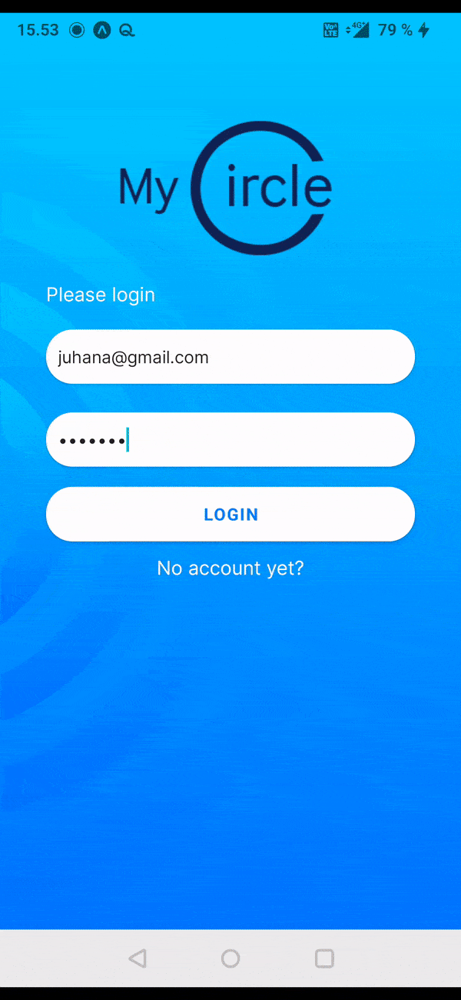

  
 

A  Smart-City application that generates real-time, contextual information and content for residents and gives residents a chance to take part in elevating their neighborhood.​

To raise residents' awareness ​of actions and events in the community and help build dynamic communities where the city and residents work together.​

## Links

 [MyCircle 📁](https://github.com/JuhanaTa/myCircle) &emsp;&emsp;&emsp;&emsp;&emsp;&emsp;&emsp;&emsp; [Demo ▶️](https://youtu.be/rT5Wi81qlJc) &emsp;&emsp;&emsp;&emsp;&emsp;&emsp;&emsp;&emsp;&emsp; [Issues Page 🐛](https://github.com/JuhanaTa/myCircle/issues)&emsp;&emsp;&emsp;&emsp;&emsp;&emsp;&emsp;&emsp;&emsp;[Install]()

## App Preview

&emsp;&emsp; 

&emsp;&emsp; 

## Technologies Used

- [React Native](https://reactnative.dev/)
- [Expo](https://expo.dev/)
- [Firebase](https://firebase.google.com/)
- [Redux: react-redux, Redux-Thunk](https://redux.js.org/introduction/getting-started)
- [react-native-maps](https://github.com/react-native-maps/react-native-maps)
- [react-native-svg](https://github.com/react-native-svg/react-native-svg)

## Authors

- **[Juhana Tamminen](https://github.com/JuhanaTa)**
- **[Mari Seppänen](https://github.com/mariksep)**
- **[Tamanji Che](https://github.com/ambeche)**
- **[Sakari Leinonen](https://www.linkedin.com/in/sakari-leinonen/)**
- **[Victor Thors](https://www.linkedin.com/in/victorthors/)**

## 🤝 Support

Contributions, issues, and feature requests are welcomed!

Give a ⭐️ if you like this project!
